<h1 align="center">Hi 👋, I'm Archie</h1>
<h3 align="center">Computer Science student @ SMU · aspiring fullstack developer</h3>

    
    
    

## About me

- 🎓 Studying **Computer Science** at SMU
- 🔭 Working on my [Google UX Design Certificate](https://www.coursera.org/professional-certificates/google-ux-design)
- 🌱 Currently learning **MongoDB**
- 👨‍💻 My projects are on my portfolio at **[4rchx824.vercel.app](https://4rchx824.vercel.app)**
- ⚡ Fun fact: I sleep **12 hours** a night on average

## 🛠️ Tech stack

<table>
    <tr>
        <td><b>Languages</b></td>
        <td>
            
             
            + pandas · Matplotlib · seaborn for data work
        </td>
    </tr>
    <tr>
        <td><b>Frontend</b></td>
        <td>
            
             
            + Recharts
        </td>
    </tr>
    <tr>
        <td><b>Backend</b></td>
        <td>
            
             
            + tRPC · T3 Stack
        </td>
    </tr>
    <tr>
        <td><b>Databases &amp; cloud</b></td>
        <td>
            
             
            + CockroachDB · SQL Server · Neon
        </td>
    </tr>
    <tr>
        <td><b>Mobile</b></td>
        <td>
            
             
            React Native · Android
        </td>
    </tr>
    <tr>
        <td><b>Tools &amp; design</b></td>
        <td>
            
        </td>
    </tr>
</table>

## 📊 GitHub stats

<!-- These cards are regenerated daily by .github/workflows/readme-cards.yml -->

    <picture>
        <source
            media="(prefers-color-scheme: dark)"
            srcset="./profile/stats-dark.svg"
        />
        
    </picture>
    <picture>
        <source
            media="(prefers-color-scheme: dark)"
            srcset="./profile/top-langs-dark.svg"
        />
        
    </picture>

